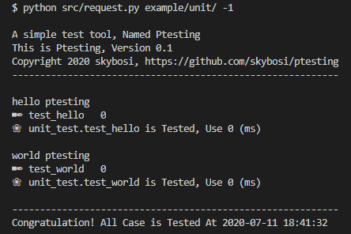
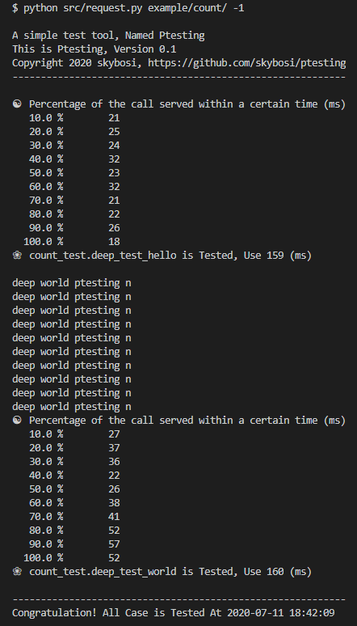

# ptesting
A simple test tool, You can use testing:

- 单元测试：`unit; args, ...`
    - unit: 测试类型（单元）
    - args: 功能测试函数的必须参数

    

- 压力测试：`count; Concurrency, Number; args, ...`
    - count: 测试类型（多次测试）
    - Concurrency: 并发量
    - Number: 执行总次数
    - args: 功能测试函数的必须参数

    

- 流程测试：`flow; Step[-Concurrency-Retry]-Total;args, ...`
    - flow: 测试类型（流程测试）
    - Step[-Retry]-Total: 流程的步骤[-重试次数]-流程的总步骤
    - args: 当前步骤功能测试函数的必须参数

    
